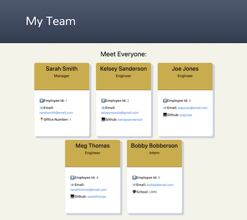

# Team Profile Generator

## Table of Contents
* [Description](README.md#Description)
* [Installation](README.md#Installation)
* [Usage](README.md#Usage)
* [License](README.md#License)
* [Test](README.md#Test)
* [Questions](README.md#Questions)

## Description
An application developed using node and inquirer to dynamically create a work team website based on user input.

## Installation
To install, clone this from my repository by entering `git clone https://github.com/kelseysanderson/team_profile_generator.git` in a terminal in a new directory. Then, run `npm init -y` followed by `npm install`. 

## Usage
Following installation, in a terminal within the directory you made enter `node index.js` to begin the program. You will then be asked to complete a series of prompts about your team, when you are done answer "no" when prompted `Would you like to add another team member?`. An html with the given information will be generated in the dist folder for you to use. 

### Walkthrough Demonstrating Usage
[View Walkthrough](https://drive.google.com/file/d/1kq9gSrCoNTn7EK1DvaAcbQcfxXq1c0TY/view)
## License
Read more about the license here:
https://opensource.org/licenses/MIT

## Test
To complete tests, run `npm run test` in your terminal in the directory you created.

### Questions
If you have any questions, feel free to contact me:

GitHub: [Kelsey Sanderson GitHub](https://github.com/kelseysanderson)

Email:  [Kelsey Sanderson Email](mailto:kelseymonica@gmail.com)
